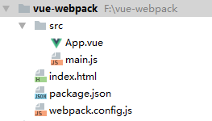

# 初始化环境

    * npm init -y  【初始化项目】

* 安装各种依赖项

    * npm install --save vue 【安装vue2.0】
    * npm install --save-dev webpack@^2.1.0-beta.25 webpack-dev-server@^2.1.0-beta.9 【安装webpack以及webpack测试服务器，默认安装是1.0版本的，所以必须指定版本号】
    * npm install --save-dev babel-core babel-loader babel-preset-es2015 【安装babel，一般的浏览器是不认识es6语法的，babel的作用是将es6的语法编译成浏览器认识的语法】
    * npm install --save-dev vue-loader vue-template-compiler 【用来解析vue的组件，.vue后缀的文件】
    * npm install --save-dev css-loader file-loader 【用来解析css】

# 配置webpack

````
/* 引入操作路径模块和webpack */
var path = require('path');
var webpack = require('webpack');

module.exports = {
    /* 输入文件 */
    entry: './src/main.js',
    output: {
        /* 输出目录，没有则新建 */
        path: path.resolve(__dirname, './dist'),
        /* 静态目录，可以直接从这里取文件 */
        publicPath: '/dist/',
        /* 文件名 */
        filename: 'build.js'
    },
    module: {
        rules: [
            /* 用来解析vue后缀的文件 */
            {
                test: /\.vue$/,
                loader: 'vue-loader'
            },
            /* 用babel来解析js文件并把es6的语法转换成浏览器认识的语法 */
            {
                test: /\.js$/,
                loader: 'babel-loader',
                /* 排除模块安装目录的文件 */
                exclude: /node_modules/
            }
        ]
    }
}
````
# 打包项目

    * npm install -g webpack@^2.1.0-beta.25 【全局安装webpack，以便使用webpack命令】

